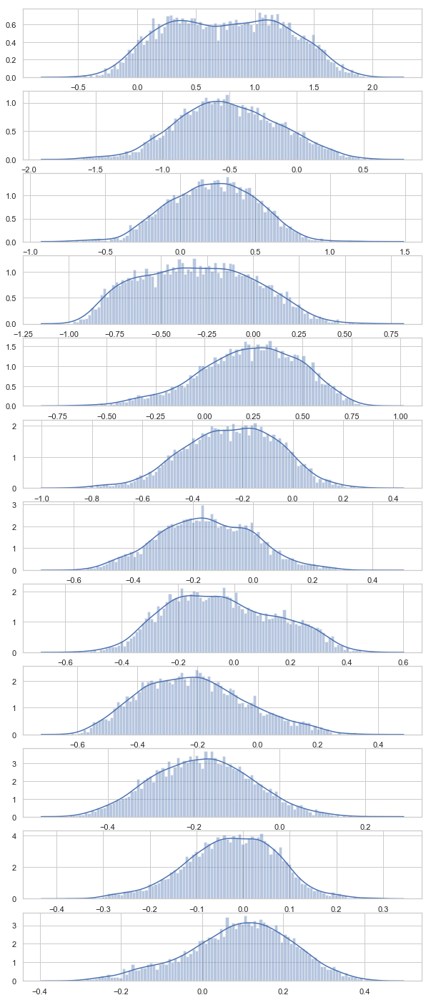
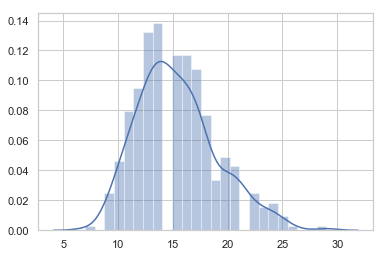
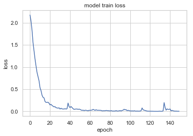
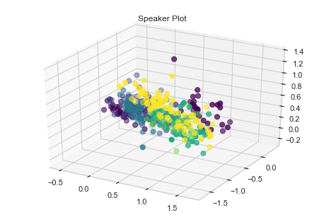
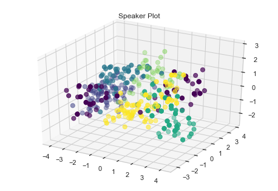

## Solution to Speaker Prediction 
----------------

### Background

The data file contains 12 LPC Coefficients obtained from 9 different male speakers while uttering the same vowel sounds. The data file has 370 blocks (equivalent to 370 utterances) each with varying number of rows (anywhere from 7-29 points), where each row correspond to 0.1 sec.. 

**Hence, we have a problem associated with time-series data with varying length.**

Therefore, we will have to deal with this varying length before we build our model. 

---
For now, we will read and store the data

### Import Libraries


```python
import numpy as np
from numpy import mean
from numpy import std
from numpy import array, loadtxt, vstack
from numpy.linalg import lstsq

import pandas as pd

# To create plots
from matplotlib.colors import rgb2hex
from matplotlib.cm import get_cmap
import matplotlib.pyplot as plt

# To create nicer plots
import seaborn as sns
sns.set(style="whitegrid")

#import visualization tools
import matplotlib as mat
from mpl_toolkits.mplot3d import Axes3D

# To create interactive plots
from plotly.offline import init_notebook_mode, iplot
import plotly.graph_objs as go
init_notebook_mode(connected=True)

from keras.preprocessing.sequence import pad_sequences
from keras.models import Sequential
from keras.layers import Dense
from keras.layers import Dropout
from keras.layers import LSTM
from keras.utils import np_utils, to_categorical

from sklearn.pipeline import Pipeline
from sklearn.preprocessing import StandardScaler
from sklearn.decomposition import PCA

from sklearn.neighbors import KNeighborsClassifier
from sklearn.model_selection import cross_val_score, cross_val_predict, GridSearchCV
from sklearn.pipeline import Pipeline
from sklearn.linear_model import LogisticRegression
from sklearn.neighbors import KNeighborsClassifier
from sklearn.tree import DecisionTreeClassifier
from sklearn import svm
from sklearn.svm import SVC
from sklearn.ensemble import RandomForestClassifier
from sklearn import metrics
```


### Load Data

Write a function to read the training data, training label, and test data.


```python
def read_train_file(block_file, block_label_file):
    block_label_index = loadtxt(block_label_file, delimiter=" ").tolist()
    file = open(block_file, "r")
    speaker_index = 0
    block_index = 0
    block = list()
    blocks = list()
    labels = list()
    for line in file.readlines():
        if line == '\n':
            label = list()
            blocks.append(block)
            label.append(speaker_index)
            labels.append(label)
            block_index += 1
            block = list()
            if speaker_index <= 8 and block_index == block_label_index[speaker_index]:
                speaker_index += 1
                block_index = 0
        else:
            point_in_time = list()
            line = line.strip('\n')
            for x in line.split(' ')[:12]:
                point_in_time.append(float(x))
            block.append(point_in_time)
    return blocks, labels
    
def read_test_file(block_file):
    file = open(block_file, "r")
    speaker_index = 0
    block_index = 0
    block = list()
    blocks = list()
    for line in file.readlines():
        if line == '\n':
            blocks.append(block)
            block_index += 1
            block = list()
        else:
            point_in_time = list()
            line = line.strip('\n')
            for x in line.split(' ')[:12]:
                point_in_time.append(float(x))
            block.append(point_in_time)
    return blocks
    
train_blocks, train_blocks_label = read_train_file('data/train.txt', 'data/train_block_labels.txt')
test_blocks = read_test_file('data/test.txt')

print("Total TrainBlock: ", np.array(train_blocks).shape, np.array(train_blocks_label).shape)    
print("Total Test Block: ", np.array(test_blocks).shape)
   
```

    Total TrainBlock:  (370,) (370, 1)
    Total Test Block:  (270,)


### Data Exploration

We will load the data and explore it with some summarization and visualization.

**1. To understand the distribution of each of the 12 LPC Coefficient values. We can plot a histogram for each of the 12 LPC Coefficient.**


```python
#use numpy vstack to stack all the blocks in point in time
point_in_time = vstack(train_blocks)
plt.figure(figsize=(10, 25))
coefficients = [0, 1, 2, 3, 4, 5, 6, 7, 8, 9, 10, 11]
for c in coefficients:
    plt.subplot(len(coefficients), 1, c+1)
    sns.distplot(point_in_time[:, c], bins=100)
plt.show()

```

    /Library/Frameworks/Python.framework/Versions/3.6/lib/python3.6/site-packages/scipy/stats/stats.py:1713: FutureWarning:
    
    Using a non-tuple sequence for multidimensional indexing is deprecated; use `arr[tuple(seq)]` instead of `arr[seq]`. In the future this will be interpreted as an array index, `arr[np.array(seq)]`, which will result either in an error or a different result.
    





From the above visualization, we see that the distributions of LPC Coefficient are close to normal showing bell-like shapes. 
Coefficient 1, 4 and 8 are little flat (with more skewness)

---

**2.  Let us visualize the distribution of the number of speaker in overall dataset.**


```python
unique, counts = np.unique(train_blocks_label, return_counts=True)
label_counts = dict(zip(unique, counts))

n = len(label_counts)
colormap = get_cmap('viridis')
colors = [rgb2hex(colormap(col)) for col in np.arange(0, 1.01, 1/(n-1))]

# Create plot
data = go.Bar(x = unique,
              y = counts,
              marker = dict(color = colors))
layout = go.Layout(title = 'Speaker Distribution',
                   xaxis = dict(title = 'Speaker'),
                   yaxis = dict(title = 'Number of Blocks'))
fig = go.Figure(data=[data], layout=layout)
iplot(fig)
```


<div>
        
        
            <div id="3697abb0-294d-4f50-90b5-0b5607265269" class="plotly-graph-div" style="height:525px; width:100%;"></div>
            <script type="text/javascript">
                require(["plotly"], function(Plotly) {
                    window.PLOTLYENV=window.PLOTLYENV || {};
                    window.PLOTLYENV.BASE_URL='https://plot.ly';
                    
                if (document.getElementById("3697abb0-294d-4f50-90b5-0b5607265269")) {
                    Plotly.newPlot(
                        '3697abb0-294d-4f50-90b5-0b5607265269',
                        [{"marker": {"color": ["#440154", "#472d7b", "#3b528b", "#2c728e", "#21918c", "#28ae80", "#5ec962", "#addc30", "#fde725"]}, "type": "bar", "uid": "2a198fdc-010a-4770-ba50-741c26abd097", "x": [0, 1, 2, 3, 4, 5, 6, 7, 8], "y": [31, 35, 88, 44, 29, 24, 40, 50, 29]}],
                        {"title": {"text": "Speaker Distribution"}, "xaxis": {"title": {"text": "Speaker"}}, "yaxis": {"title": {"text": "Number of Blocks"}}},
                        {"showLink": false, "linkText": "Export to plot.ly", "plotlyServerURL": "https://plot.ly", "responsive": true}
                    ).then(function(){
                            
var gd = document.getElementById('3697abb0-294d-4f50-90b5-0b5607265269');
var x = new MutationObserver(function (mutations, observer) {{
        var display = window.getComputedStyle(gd).display;
        if (!display || display === 'none') {{
            console.log([gd, 'removed!']);
            Plotly.purge(gd);
            observer.disconnect();
        }}
}});

// Listen for the removal of the full notebook cells
var notebookContainer = gd.closest('#notebook-container');
if (notebookContainer) {{
    x.observe(notebookContainer, {childList: true});
}}

// Listen for the clearing of the current output cell
var outputEl = gd.closest('.output');
if (outputEl) {{
    x.observe(outputEl, {childList: true});
}}

                        })
                };
                });
            </script>
        </div>


We can see that 3rd speaker have the most number of training tuples while 6 has the least. Beside, 3rd others have balanced distribution. 

---
**3. Visualizing voice data as a time-series**

We are working with voice data with a series of LPC Coefficient values in different points of time. We can group each series of LPC Coefficient according to the speaker and plot an example of voice series for each speaker. We expect to see the voice pattern for the different speaker to be different.


```python
speakers = [i + 1 for i in range(0,9)]
speakers_voice = {}
for speaker in speakers:
    speakers_voice[speaker] = [train_blocks[j] for j in range(len(speakers)) if speakers[j] == speaker]
plt.figure(figsize=(10, 35))
plt.title('LPC trend for each speaker')
for i in speakers:
    plt.subplot(len(speakers), 1, i)
    coeff_series = vstack(speakers_voice[i][0])
    for j in [0, 1, 2, 3, 4, 5, 6, 7, 8, 9, 10, 11]:
        plt.plot(coeff_series[:, j], label='test')
    plt.title('Speaker ' + str(i), y=0, loc='left')
plt.savefig('fig/lpc_series.png')
```


We can see the plot for different speaker have different patterns and we expect to classify them.

Now let us dig more into the data and see how the distribution of voice block looks like.

---

### Preprocessing Steps

**4. Understanding Block Size**

Let us visualize the distribution of block size on overall users.


```python
# histogram for block lengths
points_in_time = [len(x) for x in train_blocks]
print(pd.Series(points_in_time).describe())
sns.distplot(points_in_time, bins=25)
plt.show()
```

    count    370.000000
    mean      15.370270
    std        3.638947
    min        7.000000
    25%       13.000000
    50%       15.000000
    75%       17.000000
    max       29.000000
    dtype: float64





Since the time series data is of varying length (varying block size from 7-29), we cannot directly build a model on this dataset. So we need to generate features using the following two ways:

---

### Feature Generation

#### 1. Automatic Feature Learning
Since the data is time-series, deep neural networks are capable of automatic feature learning. Recurrent neural network like LSTM can be used. We can generate fixed length sequences and use LSTM for classification. Here are some ways to create fixed length sequences:

1. **Pad the shorter sequences with zeros** to make series equal(we might be feeding incorrect data to the model)
2. **Make all sequence equal to the maximum length** of the series and pad the sequence with the data in the last row.
3. **Make all sequence equal to the smallest series** by truncate all the other series (huge loss of data)
4. **Take the mean lengths, truncate the longer series, and pad the series which are shorter (by the last row)**.


#### 2. Feature Engineering
We can get fixed length sequences by the above method and concatenate all the blocks to a **single fixed length feature vector**. Use these feature for standard machine learning models for prediction. 

Other ideas for feature vector could be:
1. First, middle, or last n observations for a variable.
2. Mean or standard deviation for the first, middle, or last n observations for a variable.
3. Difference between the last and first n’th observations
4. Differenced first, middle, or last n observations for a variable.
5. Linear regression coefficients of all, first, middle, or last n observations for a variable.
6. Linear regression predicted the trend of first, middle, or last n observations for a variable.

---

**Going back to the sequence distribution in Blocks:**

Just a few blocks are coming up with a length more than 25 and less than 9. Thus, taking the minimum or maximum length does not make much sense. 
So the best choice for fixed block length could be 18 (we choose 18).

Now, pad smaller sequence using last rows to length of 18 and longer sequences are truncated to 18.


```python
def pad_to_fixed_size_blocks(data_block, max_length, final_block_size):
    fixed_size_block = []
    for block in data_block:
        block_len = len(block)
        last_row = block[-1]
        n = max_length - block_len
        to_pad = np.repeat(block[-1], n).reshape(12, n).transpose()
        new_block = np.concatenate([block, to_pad])
        fixed_size_block.append(new_block)
    final_dataset = np.stack(fixed_size_block)
    # truncate the sequence to final_block_size
    final_dataset = pad_sequences(final_dataset, maxlen=final_block_size, padding='post', dtype='float', truncating='post')
    return final_dataset

max_length = 29
final_block_size = 18
train_data = pad_to_fixed_size_blocks(train_blocks, max_length, final_block_size)
test_data = pad_to_fixed_size_blocks(test_blocks, max_length, final_block_size)
```

### Recurrent Neural Network

We can use a recurrent neural network (like LSTM) for classification in fixed size time-series sequences. So let us make an LSTM model and test our prediction.

#### LSTM Model
The first layer is the LSTM layer with 100 memory units (smart neurons).

Next dense layer with 100 more neurons.

To avoid overfitting we use dropout between LSTM and Dense layer.

Finally, as we are doing a classification we use a Dense output layer with a single neuron and a softmax activation function to make 0 or 1 predictions.


```python
def display_prediction(test_X, predict):
    predictions = []
    for block in range(0, len(test_X)):
        predictions.append([block,predict[block]])
    results = pd.DataFrame(predictions, columns=['block_num', 'prediction'])
    print("Results: \n\n", results)
    
def lstm_model(trainX, trainy, testX):
    trainy = to_categorical(trainy)
    verbose, epochs, batch_size = 0, 150, 64
    n_timesteps, n_features, n_outputs = trainX.shape[1], trainX.shape[2], trainy.shape[1]
    model = Sequential()
    model.add(LSTM(100, input_shape=(n_timesteps, n_features)))
    model.add(Dropout(0.5))
    model.add(Dense(100, activation='relu'))
    model.add(Dense(n_outputs, activation='softmax'))
    model.compile(loss='categorical_crossentropy', optimizer='adam', metrics=['accuracy'])
    print(model.summary())
        # fit network
    history = model.fit(trainX, trainy, epochs=epochs, batch_size=batch_size, verbose=verbose)
    
    # evaluate model
    plt.plot(history.history['loss'])
    plt.title('model train loss')
    plt.ylabel('loss')
    plt.xlabel('epoch')
    plt.show()
    display_prediction(testX, model.predict_classes(testX))
lstm_model(np.array(train_data), np.array(train_blocks_label), np.array(test_data))

```

    _________________________________________________________________
    Layer (type)                 Output Shape              Param #   
    =================================================================
    lstm_1 (LSTM)                (None, 100)               45200     
    _________________________________________________________________
    dropout_1 (Dropout)          (None, 100)               0         
    _________________________________________________________________
    dense_1 (Dense)              (None, 100)               10100     
    _________________________________________________________________
    dense_2 (Dense)              (None, 9)                 909       
    =================================================================
    Total params: 56,209
    Trainable params: 56,209
    Non-trainable params: 0
    _________________________________________________________________
    None





    Results: 
    
          block_num  prediction
    0            0           0
    1            1           0
    2            2           0
    3            3           0
    4            4           0
    5            5           0
    6            6           0
    7            7           0
    8            8           0
    9            9           0
    10          10           0
    11          11           0
    12          12           0
    13          13           0
    14          14           0
    15          15           0
    16          16           0
    17          17           0
    18          18           0
    19          19           0
    20          20           0
    21          21           0
    22          22           0
    23          23           0
    24          24           0
    25          25           0
    26          26           0
    27          27           0
    28          28           0
    29          29           0
    ..         ...         ...
    240        240           8
    241        241           8
    242        242           8
    243        243           8
    244        244           8
    245        245           8
    246        246           8
    247        247           8
    248        248           8
    249        249           8
    250        250           8
    251        251           8
    252        252           8
    253        253           8
    254        254           8
    255        255           8
    256        256           8
    257        257           2
    258        258           8
    259        259           8
    260        260           8
    261        261           8
    262        262           8
    263        263           8
    264        264           8
    265        265           8
    266        266           6
    267        267           8
    268        268           6
    269        269           8
    
    [270 rows x 2 columns]


### Standard Machine Learning Approach

---

**Feature Generation**

Since we already have a fixed length sequence we can concatenate all the blocks to a **single fixed length feature vector** and use these feature for standard machine learning models for prediction.

Let us convert fixed length blocks to a feature vector


```python
def convert_to_vectors(data_block, block_label, final_block_size):
    block_label = [i[0] for i in block_label]
    vectors = list()
    n_features = 12
    for i in range(len(data_block)):
        block = data_block[i]
        vector = list()
        for row in range(1, final_block_size+1):
            for col in range(n_features):
                vector.append(block[-row, col])
        vector.append(block_label[i])
        vectors.append(vector)
    vectors = array(vectors)
    vectors =vectors.astype('float32')
    return vectors

# dummy test label for convenience
test_blocks_label = [[i] for i in np.zeros(len(test_data))]

final_train_data = convert_to_vectors(train_data, train_blocks_label, final_block_size)
final_test_data = convert_to_vectors(test_data, test_blocks_label, final_block_size)

print(final_train_data.shape)
print(final_test_data.shape)
```

    (370, 217)
    (270, 217)


Now we have training and test set with 217 features (216 predictor and 1 target variables)

---

**Visualize Speaker using Scatter Plot**

Since we have features, let us visualize the scatter plot and see if we have a grouping cluster.


```python
train_X, train_y = final_train_data[:,:-1], final_train_data[:,-1]
### Plot Speaker
colormap = get_cmap('viridis')
colors = [rgb2hex(colormap(col)) for col in np.arange(0, 1.01, 1/(6-1))]
fig = plt.figure()
ax = fig.gca(projection='3d')
ax = Axes3D(fig)
ax.scatter(train_X[:,0], train_X[:,1], train_X[:,2], c=train_y, s=50, cmap=mat.colors.ListedColormap(colors))
plt.title('Speaker Plot')
plt.show()
```





We can see some grouping for speakers.
Let us try some standard machine algorithm and see how they perform.

---

We choose:-
1. Logistic Regression
2. KNN
3. Decision Tree
4. SVM
5. Random Forest 


```python
def compare_models(train_X, train_y):
    models, names = list(), list()
    # logistic
    models.append(LogisticRegression(solver='lbfgs', multi_class='auto'))
    names.append('LR')
    # knn
    models.append(KNeighborsClassifier())
    names.append('KNN')
    # cart
    models.append(DecisionTreeClassifier())
    names.append('CART')
    # svm
    models.append(SVC())
    names.append('SVM')
    # random forest
    models.append(RandomForestClassifier(n_estimators=100))
    names.append('RF')
    # evaluate models
    all_scores = list()
    for i in range(len(models)):
        # create a pipeline for the model
        p = Pipeline(steps=[('m', models[i])])
        scores = cross_val_score(p, train_X, train_y, scoring='accuracy', cv=5, n_jobs=-1)
        all_scores.append(scores)
        # summarize
        m, s = mean(scores) * 100, std(scores) * 100
        print('%s %.3f%% +/-%.3f' % (names[i], m, s))
        # plot
    plt.boxplot(all_scores, labels=names)
    plt.show()

compare_models(train_X, train_y)
    
```

    LR 96.532% +/-2.415
    KNN 96.490% +/-1.795
    CART 79.213% +/-4.887
    SVM 94.326% +/-2.833
    RF 95.184% +/-2.433


We present the average result of cross-validation.

We also present the result in box-and-whisker plots showing the distribution of scores.

We see Logistic Regression and KNN have a good performance, while Random forest and SVM does fair.

---
To optimse it a bit, let us use standard scaling to normalize the data and compare the performance again.


```python
def compare_models_with_scaling(train_X, train_y):
        
    models, names = list(), list()
    # logistic
    models.append(LogisticRegression(solver='lbfgs', multi_class='auto'))
    names.append('LR')
    # knn
    models.append(KNeighborsClassifier())
    names.append('KNN')
    # cart
    models.append(DecisionTreeClassifier())
    names.append('CART')
    # svm
    models.append(SVC())
    names.append('SVM')
    # random forest
    models.append(RandomForestClassifier(n_estimators=100))
    names.append('RF')

    # evaluate models
    all_scores = list()
    for i in range(len(models)):
        # create a pipeline for the model
        s = StandardScaler()
        p = Pipeline(steps=[('s', s),('m', models[i])])
        scores = cross_val_score(p, train_X, train_y, scoring='accuracy', cv=5, n_jobs=-1)
        all_scores.append(scores)
        # summarize
        m, s = mean(scores) * 100, std(scores) * 100
        print('%s %.3f%% +/-%.3f' % (names[i], m, s))
        # plot
    plt.boxplot(all_scores, labels=names)
    plt.show()

compare_models_with_scaling(train_X, train_y)
    
```

    LR 96.460% +/-1.193
    KNN 95.694% +/-2.667
    CART 81.946% +/-5.138
    SVM 97.039% +/-1.922
    RF 94.095% +/-2.274


Out of all, SVM appears to have good average performance and tight variance.


To add to it, SVM is a prefered model for a data with few number of training example having higher dimensionality of features (like in bio-informatics). Though they tends to be slow, having small dataset we do not have to worry about training speed.

So let us tune the parameter for SVM and see if we can get better results.

#### Parameter Tuning of SVM

We will use a grid search to find the best parameter.


```python
#Function to print result of the classifier
def print_result(y_test, y_pred):
#     target_names = ['Low Growth', 'High Growth']
    print(metrics.classification_report(y_test, y_pred))
    print("Confusion Matrix: \n", metrics.confusion_matrix(y_test, y_pred))

param_grid = {'C': [0.001, 0.01, 0.1, 1, 10], 'gamma': [0.001, 0.01, 0.1, 1], 'kernel':['rbf','linear']}
grid_search = GridSearchCV(svm.SVC(), param_grid, cv=5, verbose=1)
scl = StandardScaler()
train_X = scl.fit_transform(train_X)
grid_search.fit(train_X, train_y)

print("\n\nBest Parameters:      ", grid_search.best_params_)
print("\n\nBest Estimators:      ", grid_search.best_estimator_)
        
```

    Fitting 5 folds for each of 40 candidates, totalling 200 fits


    [Parallel(n_jobs=1)]: Using backend SequentialBackend with 1 concurrent workers.


    
    
    Best Parameters:       {'C': 0.01, 'gamma': 0.001, 'kernel': 'linear'}
    
    
    Best Estimators:       SVC(C=0.01, cache_size=200, class_weight=None, coef0=0.0,
      decision_function_shape='ovr', degree=3, gamma=0.001, kernel='linear',
      max_iter=-1, probability=False, random_state=None, shrinking=True,
      tol=0.001, verbose=False)


    [Parallel(n_jobs=1)]: Done 200 out of 200 | elapsed:    8.6s finished
    /Library/Frameworks/Python.framework/Versions/3.6/lib/python3.6/site-packages/sklearn/model_selection/_search.py:841: DeprecationWarning:
    
    The default of the `iid` parameter will change from True to False in version 0.22 and will be removed in 0.24. This will change numeric results when test-set sizes are unequal.
    


The best parameter set obtained using grid search are:

 ***{'C': 0.1, 'gamma': 0.001, 'kernel': 'linear'}***

Now let us see the performance of tunned svm


```python
#Test the performance of tunned svm
tuned_svm = SVC(C=0.01, cache_size=200, class_weight=None, coef0=0.0,
  decision_function_shape='ovr', degree=3, gamma=0.001, kernel='linear',
  max_iter=-1, probability=False, random_state=None, shrinking=True,
  tol=0.001, verbose=False)
y_pred = cross_val_predict(tuned_svm, train_X, train_y, cv=5)
print_result(train_y, y_pred)
```

                  precision    recall  f1-score   support
    
             0.0       0.94      0.94      0.94        31
             1.0       1.00      0.94      0.97        35
             2.0       0.99      1.00      0.99        88
             3.0       0.98      0.98      0.98        44
             4.0       0.97      1.00      0.98        29
             5.0       1.00      1.00      1.00        24
             6.0       1.00      0.97      0.99        40
             7.0       0.91      0.96      0.93        50
             8.0       0.96      0.90      0.93        29
    
       micro avg       0.97      0.97      0.97       370
       macro avg       0.97      0.97      0.97       370
    weighted avg       0.97      0.97      0.97       370
    
    Confusion Matrix: 
     [[29  0  0  0  0  0  0  1  1]
     [ 0 33  0  0  0  0  0  2  0]
     [ 0  0 88  0  0  0  0  0  0]
     [ 0  0  0 43  0  0  0  1  0]
     [ 0  0  0  0 29  0  0  0  0]
     [ 0  0  0  0  0 24  0  0  0]
     [ 0  0  0  0  0  0 39  1  0]
     [ 0  0  1  1  0  0  0 48  0]
     [ 2  0  0  0  1  0  0  0 26]]


We got decent F1-score of 97%. 
Therefore we can classify using the above setting for SVM and display the predicted value for each of the block num

### Speaker Classification


```python
def display_prediction(test_X, predict):
    predictions = []
    for block in range(0, len(test_X)):
        predictions.append([block,predict[block]])
    results = pd.DataFrame(predictions, columns=['block_num', 'prediction'])
    print("Results: \n\n", results)

# Predict using best estimator
test_X, test_y = final_test_data[:,:-1], final_test_data[:,-1]

scl = StandardScaler()
test_X = scl.fit_transform(test_X)

tuned_svm.fit(train_X, train_y)
display_prediction(test_X, tuned_svm.predict(test_X))
```

    Results: 
    
          block_num  prediction
    0            0         0.0
    1            1         8.0
    2            2         0.0
    3            3         0.0
    4            4         0.0
    5            5         0.0
    6            6         0.0
    7            7         0.0
    8            8         0.0
    9            9         0.0
    10          10         0.0
    11          11         0.0
    12          12         0.0
    13          13         0.0
    14          14         0.0
    15          15         0.0
    16          16         0.0
    17          17         0.0
    18          18         0.0
    19          19         0.0
    20          20         0.0
    21          21         0.0
    22          22         0.0
    23          23         0.0
    24          24         0.0
    25          25         0.0
    26          26         0.0
    27          27         0.0
    28          28         0.0
    29          29         0.0
    ..         ...         ...
    240        240         8.0
    241        241         7.0
    242        242         8.0
    243        243         8.0
    244        244         8.0
    245        245         8.0
    246        246         8.0
    247        247         8.0
    248        248         8.0
    249        249         8.0
    250        250         8.0
    251        251         8.0
    252        252         8.0
    253        253         2.0
    254        254         8.0
    255        255         8.0
    256        256         8.0
    257        257         8.0
    258        258         8.0
    259        259         8.0
    260        260         8.0
    261        261         8.0
    262        262         8.0
    263        263         8.0
    264        264         8.0
    265        265         8.0
    266        266         6.0
    267        267         8.0
    268        268         6.0
    269        269         8.0
    
    [270 rows x 2 columns]


### Balance Class Representation

---

Use sampling to balance class distribution as speaker 3 have the highest amount and speaker 6 has the smallest number of rows. 

Upsample 5 speaker (0, 1, 4, 5, and 8) to total 40 data (randomly choosen to give average balance representation)


```python
from sklearn.utils import resample

speaker_0 = final_train_data[final_train_data[:,-1] == 0]
speaker_1 = final_train_data[final_train_data[:,-1] == 1]
speaker_4 = final_train_data[final_train_data[:,-1] == 4]
speaker_5 = final_train_data[final_train_data[:,-1] == 5]
speaker_8 = final_train_data[final_train_data[:,-1] == 8]
others = final_train_data[np.logical_or.reduce((final_train_data[:,-1] == 2, final_train_data[:,-1] == 3, final_train_data[:,-1] == 6, final_train_data[:,-1] == 7))]

upsample_0 = resample(speaker_0, replace=True, n_samples=40, random_state=123)
upsample_1 = resample(speaker_1, replace=True, n_samples=40, random_state=123)
upsample_4 = resample(speaker_4, replace=True, n_samples=40, random_state=123)
upsample_5 = resample(speaker_5, replace=True, n_samples=40, random_state=123)
upsample_8 = resample(speaker_8, replace=True, n_samples=40, random_state=123)

args = (others, upsample_0, upsample_1, upsample_4, upsample_5, upsample_8)
balanced_train_data = np.concatenate(args)

print(len(balanced_train_data))
```

    422


```python
b_train_x = balanced_train_data[:,:-1]
b_train_y = balanced_train_data[:,-1]

unique, counts = np.unique(b_train_y, return_counts=True)
label_counts = dict(zip(unique, counts))

n = len(label_counts)
colormap = get_cmap('viridis')
colors = [rgb2hex(colormap(col)) for col in np.arange(0, 1.01, 1/(n-1))]

# Create plot
data = go.Bar(x = unique,
              y = counts,
              marker = dict(color = colors))
layout = go.Layout(title = 'Speaker Distribution',
                   xaxis = dict(title = 'Speaker'),
                   yaxis = dict(title = 'Number of Blocks'))
fig = go.Figure(data=[data], layout=layout)
iplot(fig)
```


<div>
        
        
            <div id="03796a86-a356-4a96-958d-b895c790827a" class="plotly-graph-div" style="height:525px; width:100%;"></div>
            <script type="text/javascript">
                require(["plotly"], function(Plotly) {
                    window.PLOTLYENV=window.PLOTLYENV || {};
                    window.PLOTLYENV.BASE_URL='https://plot.ly';
                    
                if (document.getElementById("03796a86-a356-4a96-958d-b895c790827a")) {
                    Plotly.newPlot(
                        '03796a86-a356-4a96-958d-b895c790827a',
                        [{"marker": {"color": ["#440154", "#472d7b", "#3b528b", "#2c728e", "#21918c", "#28ae80", "#5ec962", "#addc30", "#fde725"]}, "type": "bar", "uid": "882b6a7a-e36f-4260-955c-34f6440f1c2c", "x": [0.0, 1.0, 2.0, 3.0, 4.0, 5.0, 6.0, 7.0, 8.0], "y": [40, 40, 88, 44, 40, 40, 40, 50, 40]}],
                        {"title": {"text": "Speaker Distribution"}, "xaxis": {"title": {"text": "Speaker"}}, "yaxis": {"title": {"text": "Number of Blocks"}}},
                        {"showLink": false, "linkText": "Export to plot.ly", "plotlyServerURL": "https://plot.ly", "responsive": true}
                    ).then(function(){
                            
var gd = document.getElementById('03796a86-a356-4a96-958d-b895c790827a');
var x = new MutationObserver(function (mutations, observer) {{
        var display = window.getComputedStyle(gd).display;
        if (!display || display === 'none') {{
            console.log([gd, 'removed!']);
            Plotly.purge(gd);
            observer.disconnect();
        }}
}});

// Listen for the removal of the full notebook cells
var notebookContainer = gd.closest('#notebook-container');
if (notebookContainer) {{
    x.observe(notebookContainer, {childList: true});
}}

// Listen for the clearing of the current output cell
var outputEl = gd.closest('.output');
if (outputEl) {{
    x.observe(outputEl, {childList: true});
}}

                        })
                };
                });
            </script>
        </div>


```python
#Test the performance of tunned svm
scl = StandardScaler()
b_train_x = scl.fit_transform(b_train_x)

svm_clf = SVC(C=0.01, cache_size=200, class_weight=None, coef0=0.0,
  decision_function_shape='ovr', degree=3, gamma=0.001, kernel='linear',
  max_iter=-1, probability=False, random_state=None, shrinking=True,
  tol=0.001, verbose=False)
y_pred = cross_val_predict(svm_clf, b_train_x, b_train_y, cv=5)
print_result(b_train_y, y_pred)
```

                  precision    recall  f1-score   support
    
             0.0       1.00      1.00      1.00        40
             1.0       1.00      0.95      0.97        40
             2.0       0.99      1.00      0.99        88
             3.0       0.98      0.98      0.98        44
             4.0       1.00      1.00      1.00        40
             5.0       1.00      1.00      1.00        40
             6.0       1.00      0.97      0.99        40
             7.0       0.94      0.96      0.95        50
             8.0       0.98      1.00      0.99        40
    
       micro avg       0.99      0.99      0.99       422
       macro avg       0.99      0.98      0.99       422
    weighted avg       0.99      0.99      0.99       422
    
    Confusion Matrix: 
     [[40  0  0  0  0  0  0  0  0]
     [ 0 38  0  0  0  0  0  2  0]
     [ 0  0 88  0  0  0  0  0  0]
     [ 0  0  0 43  0  0  0  1  0]
     [ 0  0  0  0 40  0  0  0  0]
     [ 0  0  0  0  0 40  0  0  0]
     [ 0  0  0  0  0  0 39  0  1]
     [ 0  0  1  1  0  0  0 48  0]
     [ 0  0  0  0  0  0  0  0 40]]


```python
def display_prediction(test_X, predict):
    predictions = []
    for block in range(0, len(test_X)):
        predictions.append([block,predict[block]])
    results = pd.DataFrame(predictions, columns=['block_num', 'prediction'])
    results.to_csv('test.txt', header=['block_num','prediction'], index=None, sep=',')
    print("Results: \n\n", results)

# Predict using best estimator
b_train_x = balanced_train_data[:,:-1]
b_train_y = balanced_train_data[:,-1]
scl = StandardScaler()
b_train_scaled_x = scl.fit_transform(b_train_x)

test_X, test_y = final_test_data[:,:-1], final_test_data[:,-1]
test_scaled_X = scl.fit_transform(test_X)

svm_pred = SVC(C=0.01, cache_size=200, class_weight=None, coef0=0.0,
  decision_function_shape='ovr', degree=3, gamma=0.001, kernel='linear',
  max_iter=-1, probability=False, random_state=None, shrinking=True,
  tol=0.001, verbose=False)
svm_pred.fit(b_train_scaled_x, b_train_y)
display_prediction(test_scaled_X, svm_pred.predict(test_scaled_X))

```

    Results: 
    
          block_num  prediction
    0            0         0.0
    1            1         0.0
    2            2         0.0
    3            3         0.0
    4            4         8.0
    5            5         0.0
    6            6         0.0
    7            7         0.0
    8            8         0.0
    9            9         0.0
    10          10         0.0
    11          11         0.0
    12          12         0.0
    13          13         0.0
    14          14         0.0
    15          15         0.0
    16          16         0.0
    17          17         0.0
    18          18         0.0
    19          19         0.0
    20          20         0.0
    21          21         0.0
    22          22         0.0
    23          23         0.0
    24          24         0.0
    25          25         0.0
    26          26         0.0
    27          27         0.0
    28          28         0.0
    29          29         0.0
    ..         ...         ...
    240        240         8.0
    241        241         1.0
    242        242         8.0
    243        243         8.0
    244        244         8.0
    245        245         8.0
    246        246         8.0
    247        247         8.0
    248        248         8.0
    249        249         8.0
    250        250         8.0
    251        251         8.0
    252        252         8.0
    253        253         2.0
    254        254         8.0
    255        255         8.0
    256        256         8.0
    257        257         8.0
    258        258         8.0
    259        259         8.0
    260        260         8.0
    261        261         8.0
    262        262         8.0
    263        263         8.0
    264        264         8.0
    265        265         8.0
    266        266         6.0
    267        267         8.0
    268        268         6.0
    269        269         8.0
    
    [270 rows x 2 columns]


### Further Improvements

Some of the idea to explore more into:

**1. Feature Engineering:** Use better statistics for generating a feature vector for a standard machine learning model. Info like mean and std deviation of the observation, linear regression coefficients, the difference between different observation (first and the last or so).

**2. Algorithm Tuning:** We can test some other algorithm like KNN and Logistic Regression who showed good performance in the beginning.

**3. LSTM Tuning:** Try different model of LSTM and see if we can get better performance.

To test if we can further improve the performance. Let us use PCA to find independent variables.


**KNN and Logistic Regression**


```python
 # knn
knn = KNeighborsClassifier()
y_pred = cross_val_predict(knn, scaled_data_x, b_train_y, cv=5)
print_result(b_train_y, y_pred)

print("\n\n\n---Using Logistic Regression---")
 # Logistic
log = LogisticRegression(solver='lbfgs', multi_class='auto', max_iter=200)
y_pred = cross_val_predict(log, scaled_data_x, b_train_y, cv=5)
print_result(b_train_y, y_pred)


```

                  precision    recall  f1-score   support
    
             0.0       1.00      0.90      0.95        40
             1.0       0.97      0.97      0.97        40
             2.0       0.98      0.99      0.98        88
             3.0       1.00      0.95      0.98        44
             4.0       0.93      0.97      0.95        40
             5.0       0.95      1.00      0.98        40
             6.0       1.00      0.97      0.99        40
             7.0       0.89      0.96      0.92        50
             8.0       0.97      0.93      0.95        40
    
       micro avg       0.96      0.96      0.96       422
       macro avg       0.97      0.96      0.96       422
    weighted avg       0.97      0.96      0.96       422
    
    Confusion Matrix: 
     [[36  0  0  0  0  2  0  1  1]
     [ 0 39  0  0  0  0  0  1  0]
     [ 0  0 87  0  0  0  0  1  0]
     [ 0  0  1 42  0  0  0  1  0]
     [ 0  0  0  0 39  0  0  1  0]
     [ 0  0  0  0  0 40  0  0  0]
     [ 0  0  0  0  0  0 39  1  0]
     [ 0  1  1  0  0  0  0 48  0]
     [ 0  0  0  0  3  0  0  0 37]]
    
    
    
    ---Using Logistic Regression---
                  precision    recall  f1-score   support
    
             0.0       1.00      0.97      0.99        40
             1.0       1.00      0.97      0.99        40
             2.0       0.97      0.99      0.98        88
             3.0       1.00      0.93      0.96        44
             4.0       1.00      1.00      1.00        40
             5.0       1.00      1.00      1.00        40
             6.0       0.98      1.00      0.99        40
             7.0       0.96      0.98      0.97        50
             8.0       0.95      0.97      0.96        40
    
       micro avg       0.98      0.98      0.98       422
       macro avg       0.98      0.98      0.98       422
    weighted avg       0.98      0.98      0.98       422
    
    Confusion Matrix: 
     [[39  0  0  0  0  0  0  1  0]
     [ 0 39  1  0  0  0  0  0  0]
     [ 0  0 87  0  0  0  0  0  1]
     [ 0  0  0 41  0  0  1  1  1]
     [ 0  0  0  0 40  0  0  0  0]
     [ 0  0  0  0  0 40  0  0  0]
     [ 0  0  0  0  0  0 40  0  0]
     [ 0  0  1  0  0  0  0 49  0]
     [ 0  0  1  0  0  0  0  0 39]]


#### PCA Analysis


```python
# X = final_train_data
b_train_x = balanced_train_data[:,:-1]
b_train_y = balanced_train_data[:,-1]

scl = StandardScaler()
scaled_data_x = scl.fit_transform(b_train_x)
pca = PCA().fit(scaled_data_x)
#Plotting the Cumulative Summation of the Explained Variance
plt.figure()
plt.plot(np.cumsum(pca.explained_variance_ratio_))
plt.xlabel('Number of Features')
plt.ylabel('Variance (%)') #for each component
plt.title('Variance Explanation')
plt.show()
```


```python
# Reduce dimensions (speed up) and see if it is more separable
pca = PCA(n_components=50, random_state=3)
pca_fit_data = pca.fit_transform(b_train_x)

### Plot Speaker
colormap = get_cmap('viridis')
colors = [rgb2hex(colormap(col)) for col in np.arange(0, 1.01, 1/(6-1))]
fig = plt.figure()
ax = fig.gca(projection='3d')
ax = Axes3D(fig)
ax.scatter(pca_fit_data[:,0], pca_fit_data[:,1], pca_fit_data[:,2], c=b_train_y, s=50, cmap=mat.colors.ListedColormap(colors))
plt.title('Speaker Plot')
plt.show()
```




